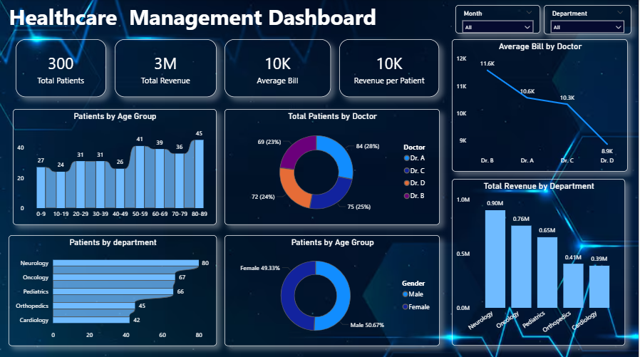

# Healthcare Management Dashboard (Power BI)

## 📊 Project Overview
This dashboard provides insights into hospital performance using interactive Power BI visualizations.

## 🎯 Key Metrics
- Total Patients
- Total Revenue
- Average Bill
- Revenue per Patient

## 📈 Insights Covered
- Revenue by Department
- Patients by Age Group
- Patients by Gender
- Doctor Performance Analysis
- Monthly Trends 

## 🛠 Tools Used
- Power BI Desktop
- DAX
- Data Modeling

## 📷 Dashboard Preview

## 📂 Files Included
- Hospital-Management-Dashboard.pbix
- Healthcare_Hospital.xlsx
- Hospital_management_dashboard.png
  
